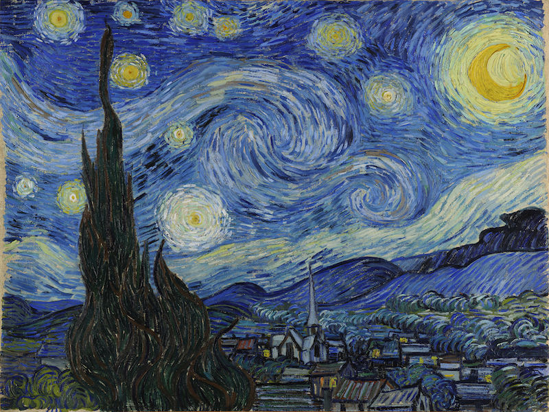
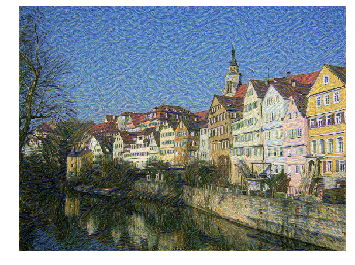

# neural-style-pytorch

### 依赖:
- fastai v1
- pytorch v1.0.0
- cuda 10.0

ST_fastai.ipynb 采用fastai自带的hook模块，可以在不更改VGG模型的结构的情况下进行HOOK
ST_pytorch.ipynb 采用pytorch vgg16_bn代码，然后进行output修改，来实现不同层输出的收集

